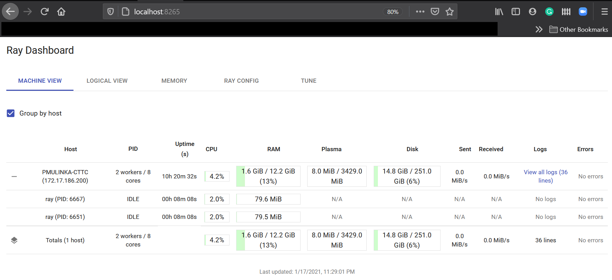
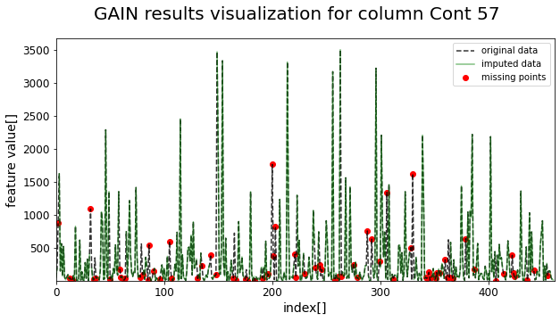

# FIREMAN-project data imputation repository

Data imputation scripts and notebooks related to [FIREMAN project](https://fireman-project.eu/) and main [FIREMAN-project repository](https://github.com/5uperpalo/FIREMAN-project/).
Reporsitory is a work-in-progress project, that is part of FIREMAN project activities. Currently it includes GAIN object oriented impelementation using PyTorch and its integration with Raytune distributed parameter searching framework.

notes included in the repository:
* [data imputation](https://github.com/5uperpalo/FIREMAN-project_imputation/blob/main/data_imputation-notes.MD)
* [deep learning notes](https://github.com/5uperpalo/FIREMAN-project_imputation/blob/main/dl-notes.MD)
* [todo list](https://github.com/5uperpalo/FIREMAN-project_imputation/blob/main/TODO.MD)

## Example usage notebooks:
* [GAIN example notebook](https://github.com/5uperpalo/FIREMAN-project_imputation/blob/main/examples/gain_example.ipynb)
* [GAIN training using Raytune](https://github.com/5uperpalo/FIREMAN-project_imputation/blob/main/examples/gain_training_using_raytune.ipynb)
  * solution support us of Raytune paramater search framework, which can be monitored by Dashboard and progress reporters
  

## install:
```
python setup.py install
```

## run tests:
```
pip install -r test-requirements.txt
python -m pytest
```

## documentation:
Automatic HTML documenation generated by sphinx is viewable at [Doc](https://github.com/5uperpalo/FIREMAN-project_imputation/blob/main/docs/_build/html/index.html) and version viewable on github using BitBucket at [Doc-git](https://htmlpreview.github.io/?https://github.com/5uperpalo/FIREMAN-project_imputation/blob/main/docs/_build/html/index.html)(you have to wait couple of seconds until theme comes up).


### generate new documenation (app\docs):
Under docs/:
```
pip install -r doc-requirements.txt
make html
```

## example data used in this repository was stolen from author of the the orginal GAIN paper

- [Author implementation in Tensorflow v1](https://github.com/jsyoon0823/GAIN)
- [SPAM dataset](https://github.com/jsyoon0823/GAIN/blob/master/data/spam.csv)

## example output available in notebooks

