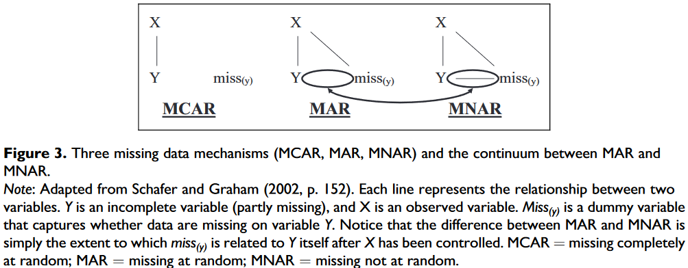
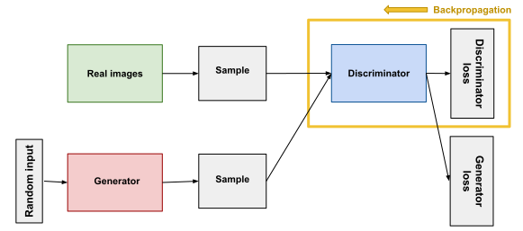
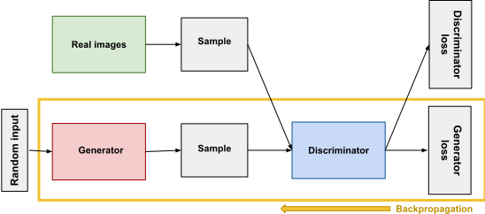
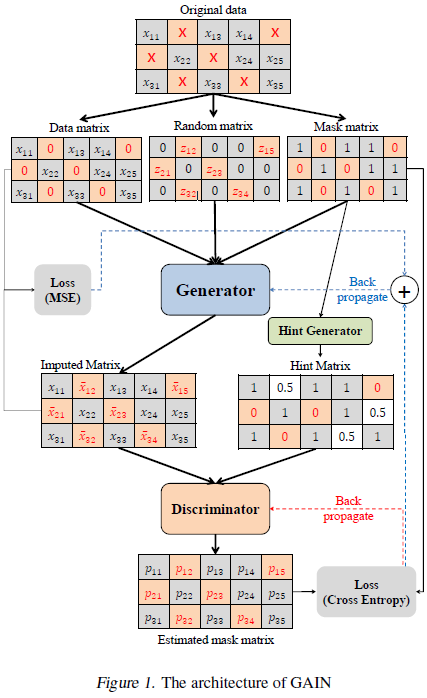

# Basic taxonomy[1]

* MCAR (missing completely at random)– the probability that a variable value is missing doesnot depend on the observed data values nor on the missing data values [i.e., p(missing|com-plete data)¼p(missing)]. The missingness pattern results from a process completely unre-lated to the variables in one’s analyses, or from a completely random process (similar toflipping a coin or rolling a die).
* MAR (‘‘missing at random’’)– the probability that a variable value is missing partly dependson other data that are observed in the dataset, but does not depend on any of the values thatare missing [i.e., p(missing|complete data)¼p(missing|observed data)].
* MNAR (missing not at random)– the probability that a variable value is missing depends onthe missing data values themselves [i.e., p(missing|complete data)6¼p(missing|observeddata)].

## Ideas in-progress
* convolutional layers to catch data chracteristics from previous N samples
  * the final data stream could be sent in high granularity to catch even slight glitches with a risk of missing samples as they would be imputed by DeepNet
* add different than "traditional data imputation", e.g. create scenarios with errors/distortions:
  * sensor failures
  * communication errors
  * injected false data
    * by accident
    * by "intruder"

## GAN architecture[2]

### Discriminator training

### Generator training

## GAIN architecture

## Other
* nice example of GANs power, [thispersondoesnotexist](https://thispersondoesnotexist.com/)
* nice project with some ideas, [R-miss-tastic](https://rmisstastic.netlify.app/)

    [1] Newman, Daniel A. "Missing data: Five practical guidelines." Organizational Research Methods 17.4 (2014): 372-411. 
    [2] [Google GAN course](https://developers.google.com/machine-learning/gan/gan_structure)
    [3] Yoon, Jinsung, James Jordon, and Mihaela Van Der Schaar. "Gain: Missing data imputation using generative adversarial nets." arXiv preprint arXiv:1806.02920 (2018).
